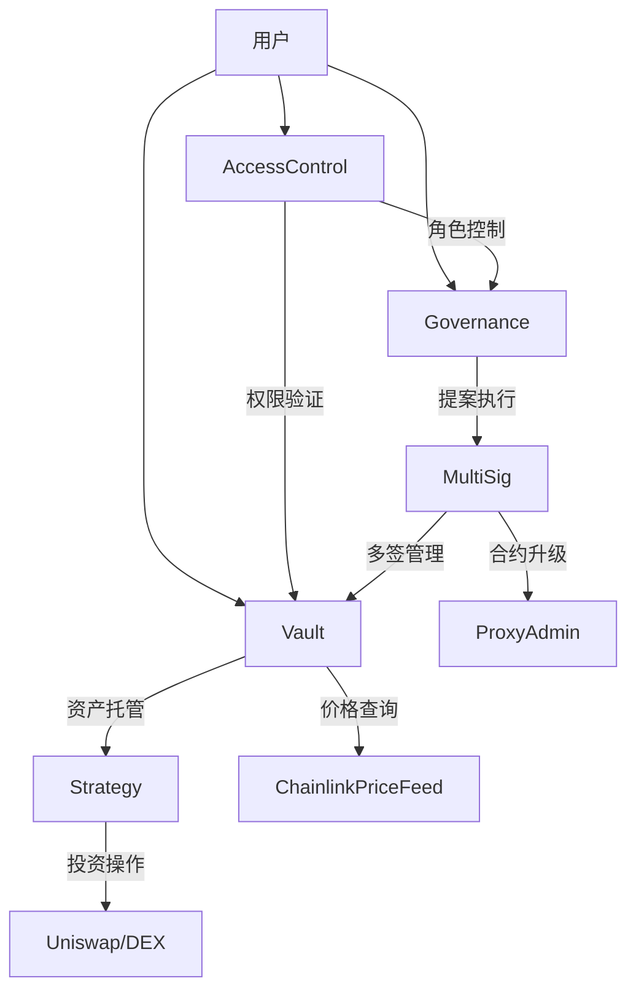

# 去中心化自治组织(DAO)

## 项目概述

基于智能合约的去中心化投资基金，允许用户通过存入加密资产获得治理代币，共同参与投资决策和收益分配。系统包含资金池管理、多签钱包、治理系统等核心模块。

## 架构设计



## 核心模块

### 1. 资金池管理 (Vault)

- **ERC4626标准**：支持多资产托管
- **收益分配**：
  ```solidity
  function distributeYield(address asset) external {
    uint256 yield = calculateYield(asset);
    _mintShares(yield);
    emit YieldDistributed(asset, yield);
  }
  ```
- **费用结构**：
  | 费用类型 | 费率 | 收取时机 |
  |---------|------|---------|
  | 管理费 | 0.5% | 每日结算 |
  | 提现费 | 0.1% | 即时扣除 |
  | 绩效费 | 15% | 收益分配时 |

### 2. 多签钱包 (MultiSig)

- **权限分级**：
  ```solidity
  enum Role {
    BASIC, // 基础交易
    ADMIN, // 合约管理
    SUPER_ADMIN // 权限修改
  }
  ```
- **交易加速**：紧急情况下可支付3倍Gas加速
- **批量执行**：最多支持10笔交易原子操作

### 3. 治理系统 (Governance)

- **提案生命周期**：
  ```mermaid
  sequenceDiagram
    用户->>+Governance: 创建提案
    Governance-->>用户: 提案ID
    用户->>+Governance: 委托投票
    Governance-->>-用户: 投票凭证
    Governance->>+TimeLock: 排队执行
    TimeLock-->>-Governance: 就绪通知
    Governance->>+Vault: 执行提案
    Vault-->>-Governance: 执行结果
  ```
- **投票机制**：
  - 链下签名投票（EIP-712）
  - 委托投票权重计算
  - 法定人数（Quorum）动态调整

### 4. 投资策略 (Strategy)

- **可插拔架构**：支持主流DeFi协议（Uniswap/Aave）
- **收益再投资**：自动复利机制
- **风险控制**：
  ```solidity
  struct RiskParams {
    uint maxLeverage; // 最大杠杆率
    uint minTVL; // 最小锁仓量
    uint slippage; // 最大滑点
  }
  ```

### 5. 访问控制 (AccessControl)

- **动态白名单**：基于默克尔树的权限验证
- **四级权限体系**：
  - 普通用户（基础操作）
  - 管理员（资金管理）
  - 超级管理员（合约升级）
  - 治理合约（提案执行）
- **时间锁机制**：关键操作需等待48小时

### 6. 合约升级 (Upgrade)

- **代理模式**：透明代理（EIP-1967）
- **升级流程**：
  ```mermaid
  graph TD
      A[提案升级] --> B[多签确认]
      B --> C[时间锁定]
      C --> D[执行升级]
      D --> E[状态迁移]
  ```
- **安全参数**：
  ```solidity
  MIN_DELAY = 2 days;   // 最短等待期
  MAX_DELAY = 14 days;  // 最长等待期
  GRACE_PERIOD = 7 days;// 宽限期
  ```

## 技术规范

### 1. 智能合约架构

| 合约名称            | 功能描述       |
| ------------------- | -------------- |
| `Vault.sol`         | 资金池管理核心 |
| `MultiSig.sol`      | 多签钱包实现   |
| `Governance.sol`    | 治理系统逻辑   |
| `Strategy.sol`      | 投资策略模板   |
| `AccessControl.sol` | 权限控制系统   |
| `ProxyAdmin.sol`    | 代理合约管理   |
| `DAOFactory.sol`    | 一键部署工厂   |
| `Timelock.sol`      | 时间锁机制     |

### 2. 部署流程

```sh
pnpm deploy:dao
```

## 安全机制

### 审计清单

- [x] 时间锁覆盖所有管理功能
- [x] 关键操作双因素验证
- [ ] 跨链资产桥接审计（进行中）

### 紧急措施

```solidity
function emergencyPause() external onlyGovernance {
  _pauseAll();
  _revokeAllRoles();
  emit EmergencyActivated(block.timestamp);
}
```

## 接口规范

### 治理接口

```typescript
interface IGovernance {
  function propose(address target, bytes calldata data) external returns (uint256);
  function vote(uint256 proposalId, uint256 amount) external;
  function execute(uint256 proposalId) external;
}
```

### 资金池接口

```typescript
interface IVault {
  function deposit(address asset, uint256 amount) external;
  function withdraw(uint256 shares) external;
  function getYield(address asset) external view returns (uint256);
}
```

## 项目里程碑

| 阶段     | 时间 | 主要内容                     |
| -------- | ---- | ---------------------------- |
| 基础设施 | 2周  | 开发环境搭建、基础合约实现   |
| 核心功能 | 4周  | 资金池、多签、治理系统开发   |
| 高级功能 | 3周  | 投资策略、访问控制、升级机制 |
| 前端开发 | 3周  | UI/UX设计、功能实现          |
| 测试部署 | 2周  | 安全审计、测试网部署         |

## 测试场景

1. **资金操作测试**

   - 多资产存款/提现
   - 收益分配验证
   - 紧急暂停恢复

2. **治理流程测试**

   - 提案创建到执行全流程
   - 链下签名投票验证
   - 时间锁延迟测试

3. **异常处理测试**
   - 合约升级回滚
   - 多签权限变更
   - 预言机失效处理
